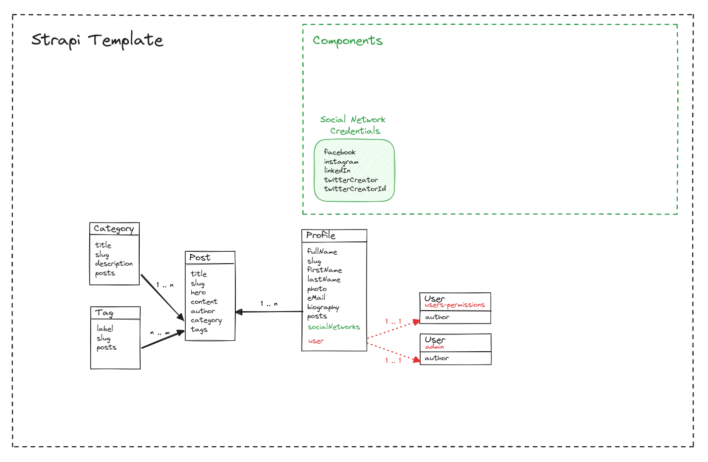

# 🚀 Getting started with Strapi Template

Strapi comes with a full featured [Command Line Interface](https://docs.strapi.io/dev-docs/cli) (CLI) which lets you scaffold and manage your project in seconds.

### `develop`

Start your Strapi application with autoReload enabled. [Learn more](https://docs.strapi.io/dev-docs/cli#strapi-develop)

```shell
npm run develop
# or
yarn develop
```

### `start`

Start your Strapi application with autoReload disabled. [Learn more](https://docs.strapi.io/dev-docs/cli#strapi-start)

```shell
npm run start
# or
yarn start
```

### `build`

Build your admin panel. [Learn more](https://docs.strapi.io/dev-docs/cli#strapi-build)

```shell
npm run build
# or
yarn build
```

## Architecture

Our template brings an architecture based on four models:

- Category
- Tags
- Profile
- Post

The following is the entity relationship schema:


Profile is intended to be also an extension of the Strapi's user model. It is up to the developer to chose between `users-permission`, Strapi's external users, and `admin`, Strapi's admin panel users. If the developer decides by `admin`, it can manage to auto fill the `author` field based on the current session user's author.

## Plugins
For the current template we pick a set of plugins to add some features by default:
- [Navigation](https://github.com/VirtusLab-Open-Source/strapi-plugin-navigation): A plugin for Strapi Headless CMS that provides navigation / menu builder feature with their possibility to control the audience and different output structure renderers like (flat, tree and RFR - ready for handling by Redux First Router).
- [Preview Button](https://github.com/mattmilburn/strapi-plugin-preview-button): A plugin for Strapi CMS that adds a preview button and live view button to the content manager edit and list view. It has an [PR candidate](https://github.com/mattmilburn/strapi-plugin-preview-button/pull/133/files) for Strapi 5 in development.
- [SEO](https://github.com/strapi/strapi-plugin-seo): The official plugin to make your Strapi content SEO friendly.[ We asked an update](https://github.com/strapi/strapi-plugin-seo/issues/70) for Strapi 5.
- [Sitemap](https://github.com/pluginpal/strapi-plugin-sitemap): Generate a highly customizable sitemap XML in Strapi CMS.
  
We also recommend to check the following plugins when it is required:
- [Cloudflare Pages](https://github.com/sarhugo/strapi-plugin-cloudflare-pages): A plugin to easily trigger Cloudflare Pages builds from Strapi. Since [we can use webhooks to keep the Vercel deployed pages updated](https://strapi.io/blog/how-to-create-an-ssg-static-site-generation-application-with-strapi-webhooks-and-nextjs), we don't recomment any plugin for Vercel.
- [Meilisearch](https://github.com/meilisearch/strapi-plugin-meilisearch): A strapi plugin to add your collections to Meilisearch, making easier to add searching features to your frontend. We were unable to find a plugin for Typesense, another powerful search engine; [we asked for it](https://github.com/typesense/typesense/issues/1691) on the repository.
All plugins listed here don't currently support Strapi 5 yet.

## ⚙️ Deployment

Strapi gives you many possible deployment options for your project including [Strapi Cloud](https://cloud.strapi.io). Browse the [deployment section of the documentation](https://docs.strapi.io/dev-docs/deployment) to find the best solution for your use case.

## 📚 Learn more

- [Resource center](https://strapi.io/resource-center) - Strapi resource center.
- [Strapi documentation](https://docs.strapi.io) - Official Strapi documentation.
- [Strapi tutorials](https://strapi.io/tutorials) - List of tutorials made by the core team and the community.
- [Strapi blog](https://strapi.io/blog) - Official Strapi blog containing articles made by the Strapi team and the community.
- [Changelog](https://strapi.io/changelog) - Find out about the Strapi product updates, new features and general improvements.

Feel free to check out the [Strapi GitHub repository](https://github.com/strapi/strapi). Your feedback and contributions are welcome!

## ✨ Community

- [Discord](https://discord.strapi.io) - Come chat with the Strapi community including the core team.
- [Forum](https://forum.strapi.io/) - Place to discuss, ask questions and find answers, show your Strapi project and get feedback or just talk with other Community members.
- [Awesome Strapi](https://github.com/strapi/awesome-strapi) - A curated list of awesome things related to Strapi.

---

<sub>🤫 Psst! [Strapi is hiring](https://strapi.io/careers).</sub>
